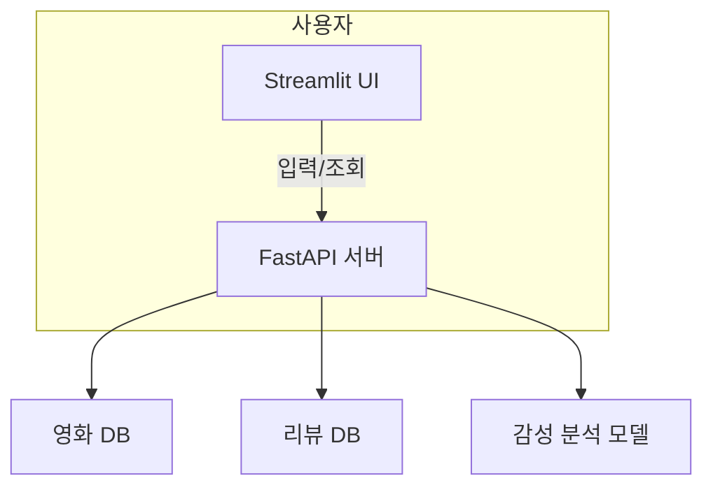

# 🎬 스프린트 미션 18: 감성 분석 기반 영화 리뷰 웹 애플리케이션

## 📌 서비스 개요

> 서비스명: 감성 리뷰 영화관
> 
> 
> **기능 요약**:
> 
> - 영화 정보 등록 및 목록 조회
> - 영화별 리뷰 등록 및 감성 분석
> - 최근 리뷰 및 분석 결과 표시
> - Streamlit 프론트엔드 + FastAPI 백엔드 구조

---

## 🏗️ 서비스 구조도



---

## 🌐 프론트엔드 구조 (Streamlit)

| 기능 | 설명 |
| --- | --- |
| 영화 목록 조회 | 제목, 포스터, 평균 평점 표시 |
| 영화 등록 | 제목, 개봉일, 감독, 장르, 포스터 URL 입력 |
| 리뷰 등록 | 영화 선택 후 작성자, 내용 입력 |
| 감성 분석 | 리뷰 작성 시 자동 분석 결과 표시 |
| 리뷰 목록 | 최근 10개 리뷰, 감성 분석 결과 포함 |
| 배포 | Streamlit Cloud 이용 |

---

## 🧩 백엔드 구조 (FastAPI)

### 📁 주요 라우터

- `/movies`
    - `GET /movies`: 전체 영화 조회
    - `POST /movies`: 영화 등록
    - `GET /movies/{movie_id}`: 특정 영화 조회
    - `DELETE /movies/{movie_id}`: 영화 삭제
- `/reviews`
    - `POST /reviews`: 리뷰 등록 및 감성 분석
    - `GET /reviews`: 전체 리뷰 조회
    - `GET /reviews/movie/{movie_id}`: 특정 영화 리뷰 조회
    - `DELETE /reviews/{review_id}`: 리뷰 삭제
- `/scores`
    - `GET /scores/movie/{movie_id}`: 특정 영화 리뷰 감성 점수 평균 조회

### 🧠 감성 분석 모델

- HuggingFace 또는 Scikit-learn 기반 간단한 감성 분석기
- 키워드 기반 긍/부정 분류 또는 사전 학습된 경량 모델 사용
- (심화) ONNX 변환 및 모델 경량화 시도

---

## 🧱 데이터베이스 구조 (ERD)

```mermaid
mermaid
코드 복사
erDiagram
  MOVIES ||--o{ REVIEWS : has
  MOVIES {
    int id PK
    string title
    string release_date
    string director
    string genre
    string poster_url
  }
  REVIEWS {
    int id PK
    int movie_id FK
    string author
    string content
    string sentiment
    datetime created_at
  }

```

---

## 📜 FastAPI Docs 캡처

> 🔽 FastAPI 자동 문서 (http://localhost:8000/docs) 전체 스크린샷 첨부
> 
> - 엔드포인트, 요청 예시, 응답 스키마 포함
> - 각 기능의 설명 명세 작성

---

## 🖼️ 서비스 동작 캡처

- ✅ 영화 등록 화면
- ✅ 영화 목록 조회 화면 (포스터, 제목, 평균 평점)
- ✅ 리뷰 등록 및 감성 분석 결과
- ✅ 최근 리뷰 목록 표시 화면
- ✅ Streamlit 웹 UI 전체 흐름 캡처

---

## 🎥 영화 및 리뷰 데이터

- 등록 영화: **3편 이상**
    - 예: 《기생충》, 《인터스텔라》, 《이터널 선샤인》
- 영화별 리뷰: **각각 10개 이상**
    - 작성자 이름, 리뷰 본문, 감성 결과 포함

---

## 💻 코드 제출 구조

```plaintext
mission18/
└── 팀명_이름/
    ├── report.pdf
    ├── frontend/
    │   ├── streamlit_app.py
    │   └── utils.py ...
    ├── backend/
    │   ├── main.py
    │   ├── routers/
    │   │   ├── movies.py
    │   │   └── reviews.py
    │   ├── models/
    │   ├── schemas/
    │   ├── database.py
    │   └── sentiment_model.py

```

---

## ✅ 체크리스트

- []  영화 3편 이상 등록
- []  각 영화당 리뷰 10개 이상
- []  Streamlit Cloud 배포
- []  FastAPI 문서 캡처
- []  ERD 포함
- []  보고서 PDF 제출
